# Finetune LoRA / DPO for Function Calling

[](https://github.com/Muhammad-Farooq13/Finetune-lora-dpo/actions/workflows/ci.yml)


Fine-tuning **Qwen2.5-1.5B-Instruct** for structured function-call generation
using **QLoRA** (4-bit NF4) for Supervised Fine-Tuning and **Direct Preference
Optimisation (DPO)** with synthetically generated rejection pairs.

The result: **93.7% valid JSON** and **79.8% exact tool match** up from a 23.4%
/ 18.7% zero-shot baseline — all without any full-precision weight updates.

---

## Results

| Model | Valid JSON | Tool Match | Param F1 | Hallucination |
|---|---|---|---|---|
| Base (zero-shot) | 23.4 % | 18.7 % | 0.214 | 61.3 % |
| SFT + LoRA | 91.2 % | 74.3 % | 0.714 | 12.4 % |
| **DPO** | **93.7 %** | **79.8 %** | **0.771** | **8.9 %** |

Evaluated on 1,000 held-out samples from
[glaiveai/glaive-function-calling-v2](https://huggingface.co/datasets/glaiveai/glaive-function-calling-v2).


---

## 🏗️ Architecture Diagram

```mermaid
flowchart TD
    A([📦 glaiveai/glaive-function-calling-v2\n112k examples]) --> B[DataLoader + ChatML Formatter\nSystem prompt · function schemas · calls]

    B --> C[🔢 Tokenizer\nQwen2.5-1.5B-Instruct]
    C --> D[⚙️ BitsAndBytes 4-bit NF4\ndouble quant · compute_dtype bfloat16]
    D --> E[🧩 LoRA Adapter Injection\nr=16 · alpha=32 · dropout=0.05\ntarget: q_proj k_proj v_proj o_proj\n~1.3% trainable parameters]

    E --> F[🏋️ SFT Training\nTRL SFTTrainer · 3 epochs\ncosine LR · gradient checkpointing]
    F --> G([📁 SFT Checkpoint\nValid JSON: 91.2% · Tool Match: 74.3%])

    G --> H[🔄 PreferenceBuilder\n4 rejection strategies:\nwrong_tool · missing_param\nbad_json · hallucinated_param]
    H --> I[📊 DPO Pair Dataset\nchosen: correct calls\nrejected: synthetic errors]

    I --> J[🎯 DPO Training\nTRL DPOTrainer · beta=0.1\nreference model frozen]
    J --> K([🏆 DPO Checkpoint\nValid JSON: 93.7% · Tool Match: 79.8%\nParam F1: 0.771 · Hallucination: 8.9%])

    K --> L[📋 Evaluation\n1 000 held-out samples\nJSONSchema validation + exact match]
    L --> M[📈 Streamlit Dashboard\nModel comparison · DPO pairs · live demo]

    style A fill:#1a1a2e,color:#58A6FF
    style G fill:#1a1a2e,color:#F0DB4F
    style K fill:#6E40C9,color:#fff,stroke:#FF6B6B
    style M fill:#58A6FF,color:#fff
```



---

## Streamlit Demo

```bash
pip install -r requirements.txt
streamlit run streamlit_app.py
```

**Tabs:**

| Tab | Description |
|---|---|
| 📊 Results Dashboard | Model comparison charts — Valid JSON, Tool Match, Parameter F1, Hallucination Rate |
| 🔧 Formatter Explorer | Live system-prompt builder with function schemas; ChatML preview; JSON extraction |
| 🧪 DPO Pair Builder | Visualise chosen/rejected pair generation using all four rejection strategies |
| ⚙️ Pipeline & Architecture | Training configs, LoRA/DPO configs, improvement table, live metrics evaluation |

---

## Quick Start

```bash
# Clone
git clone https://github.com/Muhammad-Farooq13/Finetune-lora-dpo.git
cd Finetune-lora-dpo

# Install full dependencies (GPU machine with CUDA recommended)
pip install -r requirements.txt

# Run SFT training (Qwen2.5-1.5B-Instruct, QLoRA 4-bit)
python scripts/train_sft.py

# Build DPO preference pairs + train DPO
python scripts/train_dpo.py

# Evaluate
python scripts/evaluate.py --adapter checkpoints/dpo

# Interactive CLI demo
python scripts/demo.py --adapter checkpoints/dpo

# Streamlit demo (no GPU needed)
streamlit run streamlit_app.py
```

---

## Project Structure

```
├── src/
│   ├── config/         # TrainingConfig dataclass
│   ├── data/           # DataLoader, Formatter, PreferenceBuilder
│   ├── evaluation/     # FunctionCallMetrics, evaluate_single
│   ├── inference/      # FunctionCallingPipeline
│   ├── model/          # LoRA config builder, model loader
│   └── training/       # SFTTrainer, DPOTrainer wrappers
├── scripts/
│   ├── train_sft.py    # SFT training entry point
│   ├── train_dpo.py    # DPO training entry point
│   ├── evaluate.py     # Evaluation script
│   ├── demo.py         # Interactive CLI demo
│   └── download_data.py
├── data/samples/       # Example function schemas (5 tools)
├── experiments/
│   └── results.json    # Full benchmark results
├── tests/              # 46 unit tests (pytest)
├── streamlit_app.py    # Interactive demo (no GPU required)
├── requirements.txt    # Runtime dependencies
├── requirements-ci.txt # Lightweight CI dependencies
└── .github/workflows/ci.yml
```

---

## Training Details

### SFT with QLoRA

| Parameter | Value |
|---|---|
| Base model | Qwen/Qwen2.5-1.5B-Instruct |
| LoRA rank (r) | 16 |
| LoRA alpha | 32 |
| Target modules | q/k/v/o + gate/up/down proj |
| Quantisation | 4-bit NF4 (QLoRA) |
| Trainable params | 13.1M / 1.54B (0.85%) |
| Epochs | 3 |
| Effective batch | 16 |
| LR scheduler | cosine |
| Packing | Yes |
| Training time | 2h 34m |
| Hardware | 4× NVIDIA A100 40GB |
| Peak VRAM | 18.3 GB |

### DPO

| Parameter | Value |
|---|---|
| Beta (β) | 0.1 |
| Loss type | sigmoid |
| DPO pairs | 87,241 |
| Rejection strategies | wrong_function, wrong_params, missing_params, hallucinate |
| Epochs | 1 |
| Training time | 47 min |
| Peak VRAM | 22.1 GB |

---

## Evaluation Metrics

- **valid_json_rate** — % of outputs parseable as valid JSON
- **exact_tool_match_rate** — % where predicted function name == ground truth
- **parameter_f1** — token-level F1 across all argument values
- **hallucination_rate** — % where predicted function is not in the schema
- **rouge_l** — sentence-level ROUGE-L F1 on the full completion

---

## Running Tests

```bash
pip install -r requirements-ci.txt
pytest tests/ -v
```

46 tests across formatter, metrics, and preference builder — no GPU required.

---

## License

MIT License — see [LICENSE](LICENSE).
